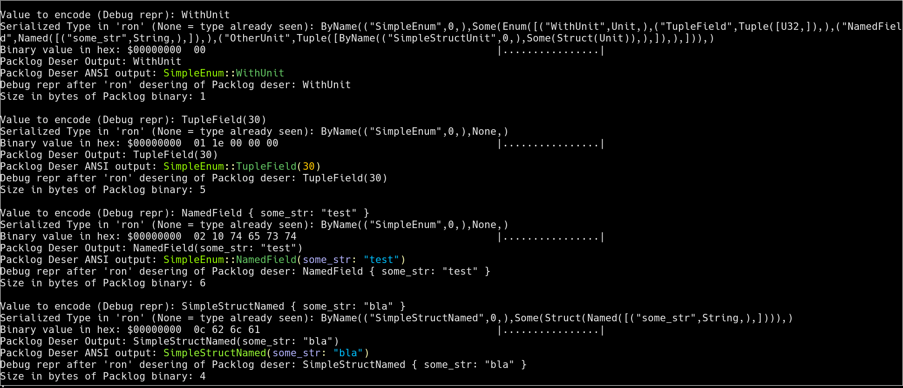

# Logpack

An _asymmetric_ compact encoder and decoder pair that is oriented for logging.

Similarly to [bincode](https://github.com/TyOverby/bincode), the encoded values
are in binary form, take a few bytes as possible, and contain no type information.

However, there is a significant difference from bincode due to the asymmetry of
the encoding and decoding stages:

* Logpack provides a special custom-derivable trait for the representation of the
**type** that is serializable and deserializable using 'serde', in addition to
a custom-derivable trait for the values. The type of each value is expected to
be serialized and saved separately, possibly only during a single invocation of
the program. Different values of the same type be serialized many times in a
compact and performant manner.

* Deserialization of the encoded binary values receives the type in run-time
instead of compile time. Thus, the originally typed value is not constructed
directly, but can be examined and printed in a dynamically structured way.

This makes logpack suitable in cases where log writing and log viewing is done
by separate programs. That is because - for the viewers, the types are not
known in compilation time.

Example output taken from test program:

## To-do

* Documentation
* A lot of testing
* Some cleanups
